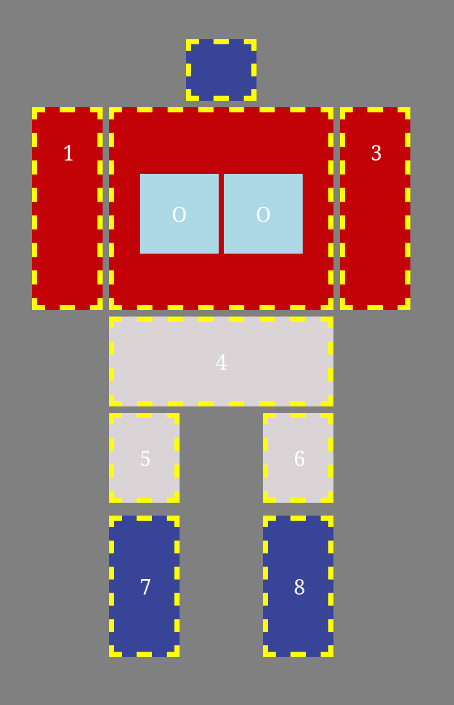
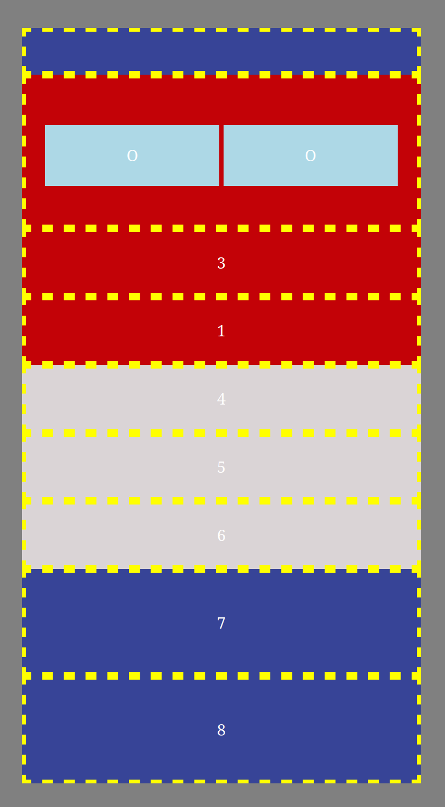
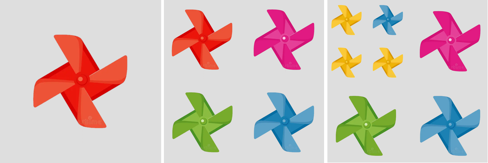
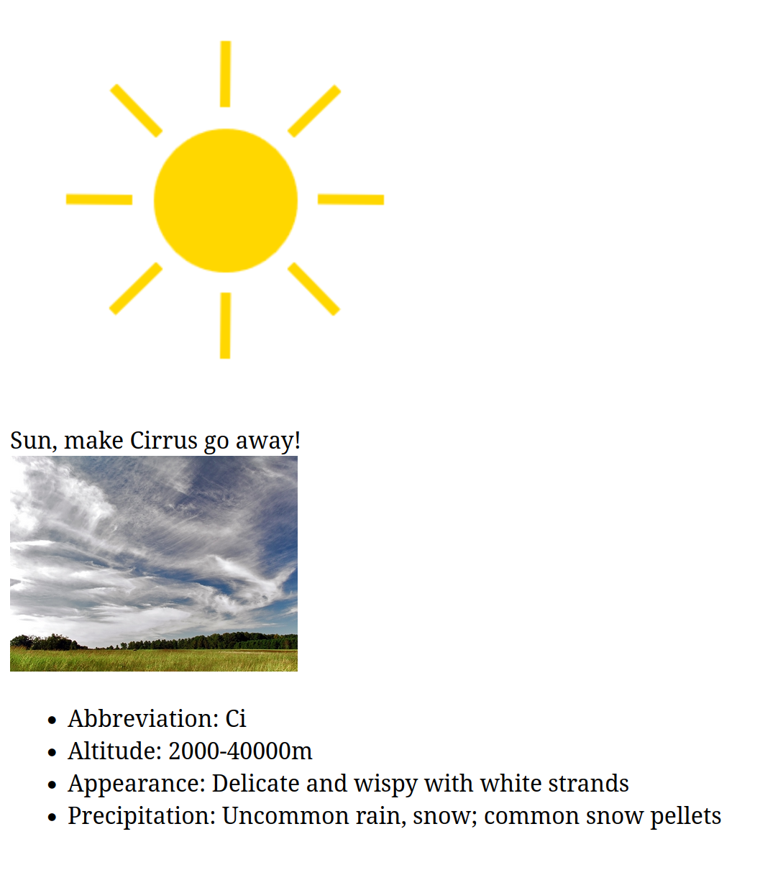

# Examinare restanță 7 septembrie

Încărcați rezolvările (toate fișierele folosite în rezolvări, inclusiv fișierele furnizate pe această pagină) într-o arhivă .zip cu numele de forma nrgrupa_nume_prenume.zip la [această adresă de dropbox](https://www.dropbox.com/request/0h94Ne0BhuiCyT5XNdgv). Toate subiectele sunt obligatorii. Condiția de promovare a examinării este obținerea a 3 puncte din 6.

## A. layout, tranziții, media query (1.5 puncte)
1. Scrieți un fișier HTML `optimus.html` care să conțină un div cu clasa `container`. În interiorul lui, adăugați încă alte 11 divuri. Creați un fișier `optimus.css` în care să adăugați reguli CSS astfel încât pagina să arate ca în imaginea de mai jos și:
- fiecare coloană să aibă lățimea de 55px
- spațiul dintre liniile și coloane să fie de 5px
- divurile să aibă padding de 20px (mai puțin divurile pentru trunchi și picioare; acestea să aibă padding vertical de 40px)
- textul să fie centrat pe orizontală
- divurile vor avea fundal de culoare albastru închis `#374497`, roșu `#c30207`, gri deschis `#dad4d6`, sau `lightblue`, textul colorat cu alb și border galben, întrerupt, de 4px
- divurile bleu nu vor avea border.

2. Adăugați reguli CSS astfel încât la ținerea mouse-ului apăsat pe divurile bleu
- divurile vor avea fundal galben
- se vor micșora la 0.85 din mărimea inițială, treptat, într-o tranziție de 0.33s.
 

3. Scrieți un media query pentru ferestre cu lățimea între 270px și 640px astfel încât divurile să nu mai fie afișate cu layoutul de mai sus, ci în formatul default, unele sub altele, ocupând întreaga lățime a containerului, precum în imaginea de mai jos.

## B. round and round: events, DOM, localStorage (2.5 puncte)

4. Scrieți un fișier HTML `wind.html` care să conțină un body gol și să încarce fișierul de stil `wind.css` pe care îl puteți găsi în directorul `resources`. Adăugați cod JavaScript în fișierul `wind.js` astfel încât să creați în mod dinamic un tabel care să aibă inițial un rând și o coloană. Celula din tabel va conține imaginea `wind1.png` din directorul `resources/images` cu lățimea de 300px.

6. La apăsarea tastei `w`, se va alege o morișcă aleator din tabel și se va înlocui cu patru moriști de dimensiune mai mică (jumătate din dimensiunea moriștii alese). Imaginile folosite pentru moriști vor fi alese în mod aleator dintre cele cinci imagini cu moriști din directorul `resources/images` (`wind-1.png`, `wind-2.png`, `wind-3.png`, `wind-4.png`, `wind-5.png`). De exemplu, în imaginea de mai jos, a fost aleasă aleator (în mod repetat, de două ori) prima morișcă din colțul din stânga sus a ecranului și înlocuită cu 4 moriști mai mici.

5. La apăsarea unei moriști de pe ecran, aceasta va începe să se rotească în sens invers acelor de ceasornic. Hint: folosiți codul din fișierul `wind.css`. La o nouă apasare a unei moriști ce se rotește, se va schimba direcția de rotire. La apăsarea tastei 's', se vor opri din rotit toate moriștile.

5. Salvați în `localStorage` numărul de moriști create în total și afișați-l în colțul din dreapta sus a ecranului.

## C. here comes the sun: events, canvas, fetch (2 puncte)

9. Scrieți un fișier HTML `sun.html` astfel încât să desenați, folosind fie elementul `canvas` (și cod JavaScript), fie cod CSS, un soare ca în imaginea de mai jos.

Hint: culoarea folosită este Gold, iar trigonometria este prietena voastră în misiunea de desenare a razelor de soare.

Dacă nu știți să desenați soarele folosind canvas sau CSS, puteți folosi imaginea 'resources/images/sun.png' pentru a continua rezolvarea subiectului (cu punctaj parțial, pentru neîndeplinirea primei cerințe).

10. La apăsarea soarelui, se va alege un nor din lista de tipuri de nori din fișierul `clouds.json`. Folosiți fetch și promisiuni pentru a accesa conținutul fișierului pe un server http local (porniți un server http folosind, de exemplu, Python, cu comanda `python3 -m http.server 5000`). La fiecare click pe soare, se va alege aleator un tip de nori și se va afișa sub soare un mesaj de forma "Sun, make tip-nori go away!" (tip-nori fiind extras din fișierul json, din câmpul `name`) și imaginea asociată tipului de nori.

11. La trecerea cu mouse-ul deasupra imaginii, se va afișa sub ea o listă neordonată conținând caracteristicile tipului de nori înregistrate în fișierul .json.

